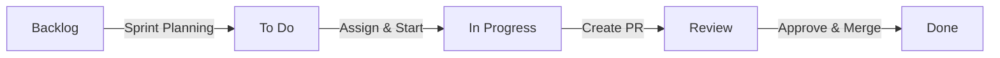

# Guía Kanban - GitHub Projects

## Configuración del Tablero

### 1. Crear el proyecto en GitHub
1. Ir a https://github.com/<org>/<repo>/projects
2. Clic en "Create project" → "Board" (Kanban)
3. Nombre: `CallCenter Integration`

### 2. Columnas del tablero

| Columna | Descripción | WIP Limit |
|---------|-------------|-----------|
| **Backlog** | User stories priorizadas sin asignar | Sin límite |
| **To Do** | Tareas listas para comenzar | 8 |
| **In Progress** | Tareas en desarrollo activo | 4 (1 por integrante) |
| **Review** | Tareas en revisión de código (PR) | 4 |
| **Done** | Tareas completadas y mergeadas | Sin límite |

### 3. Convertir issues en cards
- Cada User Story (US-001 a US-016) se crea como **Issue** en GitHub
- Se etiquetan por épica: `infraestructura`, `midpoint`, `asterisk`, `seguridad`, `documentacion`
- Se asignan a integrantes según la fase

### 4. Workflow sugerido

### 5. Automatización (opcional)
- Configurar GitHub Actions para mover cards automáticamente:
  - Issue abierto → To Do
  - PR creado → Review
  - PR mergeado → Done

## Asignación por Fase

| Fase | Issues | Asignado | Rama |
|------|--------|----------|------|
| **Fase 1** | US-001, US-002, US-003, US-014, US-015 | Integrante 1 (PO) | main |
| **Fase 2** | US-004, US-007, US-008 | Integrante 2 (DevOps) | feature/asterisk-config |
| **Fase 2** | US-005, US-006 | Integrante 3 (DevOps) | feature/midpoint-integracion |
| **Fase 3** | US-009 | Integrante 2 + 3 | feature/midpoint-integracion |
| **Fase 4** | US-010, US-011, US-012, US-013 | Integrante 4 (QA) | feature/security-tls |
| **Fase 5** | US-016 | Todos | feature/documentacion |

## Reglas del equipo
1. **WIP limit**: Nadie puede tener más de 1 tarea en "In Progress" a la vez
2. **PR obligatorio**: Todo merge a `main` requiere PR aprobado por otro integrante
3. **Commits por feature**: `git commit -m "feat: descripción (#US-XXX)"`
4. **Daily standup**: Cada día cada integrante mueve sus cards y comenta avances
